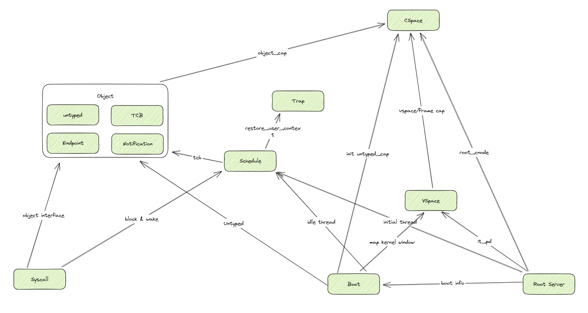

## Linux

之前的Linux内核和QEMU实现有一些问题，进行了如下修正：

- 在QEMU中修改uipi_read的语义为读出uipi后清零，uipi_write的语义为给寄存器或上一个值。

- 在每次陷入异常和从异常中恢复时关闭和开启用户态中断。

- 在写入UIE和UIP之前设置sideleg.usip。

在修正后，用户态中断的速度是signal等IPC实现的10倍左右，与intel实现的用户态中断性能加速比相近。

## seL4

### Notifications

Notifications允许进程间互相发送异步引号，主要被用于中断处理以及同步共享数据缓存。

#### Notification Objects

信号通过调用notification的capabilities进行收发。一个Notification Object由data word（被视作二进制信号量数组）和一个正在等待notification的TCB队列构成。

Notification Objects有以下三种状态：

- Waiting: TCB队列中有TCB等待Signal
- Active: TCB已在该notification上发送数据
- Idle: 没有TCB在队列中且从它被设置为Idle后没有TCB被发送信号。

#### Signalling

当一个任务在一个通知对象上发送信号时（使用 `seL4_Signal`），表现出来的行为跟Notification Object的状态有关：

- Waiting：TCB等待队列的头部被唤醒，badge被发送到该TCB上，如果队列为空，则对象转化为空闲状态。
- Active：用于向通知对象发送消息的badge记与通知数据字按位与。
- Idle：数据字设置为用于发送信号的能力标志，对象转换为激活状态。

#### Waiting

通过 `seL4_Wait` 等待一个通知：

- Waiting：TCB入队尾进行等待。

- Active：TCB接收到数据字，数据被置为0，状态转换为空闲状态。

- Idle：TCB入队等待，并且转换为等待状态。

#### Polling

任务可以调用`seL4_Polling`来轮询队列，效果相当于非阻塞的`seL4_Wait`，会立即返回结果。

## seL4结构分析

首先，seL4主要有如下模块：

- Boot：内核的入口，负责初始化内存和 untyped，填充 NDKS_BOOT 这个数据结构。创建 Idle Thread。初始化中断向量表。
- Root Server：创建和初始化 Root Server 的内核对象，，创建各种子对象对应的cap（CSpace）， 创建 Vspace， 创建和初始化Root Server的虚拟内存映射。初始化 Root Server 的 Initial Thread 。
- CSpace：提供各种Cap和CNode、TCBCNode的定义以及定义在其上的操作接口。这个是最独立的，不依赖其他任何模块。
- VSpace：首先在 boot 阶段提供对内核地址空间的的VSpace的初始化。其次还提供各种map操作和查找操作。
- Schedule：全局调度的相关数据和对应的调度接口。
- Trap：定义用户态和内核态的切换接口。
- Object：定义各种内核对象，以及在上面可以完成的一些操作接口。
  - untyped
  - TCB
  - endpoint
  - notification
- Syscall：主要用于处理中断、异常和系统调用。这里的依赖比较复杂。几乎依赖了上面提到的所有模块。



Notification相关的模块在Object和syscall中。

### seL4代码分析

在编译过程上来看，seL4由三部分构成：

- head.S：负责内核启动的少量汇编代码。
- trap.S：负责陷入和中断时保存上下文的少量汇编代码。
- kernel_all.c：内核代码。

kernal_all.c 在build过程中由脚本生成，它是将49个c文件合并而成的。

userlib中`seL4_Signal`的实现：

```c
LIBSEL4_INLINE_FUNC void seL4_Signal(seL4_CPtr dest)
{
	riscv_sys_send_null(seL4_SysSend, dest, seL4_MessageInfo_new(0, 0, 0, 0).words[0]);
}
```

可以发现调用了IPC中的`sys_send`：

```c
case SysSend:
	ret = handleInvocation(false, true, false, false,getRegister(NODE_STATE(ksCurThread), capRegister));
	if (unlikely(ret != EXCEPTION_NONE)) {
		mcsPreemptionPoint();
		irq = getActiveIRQ();
		if (IRQT_TO_IRQ(irq) != IRQT_TO_IRQ(irqInvalid)) {
			handleInterrupt(irq);
		}
}
break;
```

其中主要逻辑在于`handleInvocation`->`performInvocation_Notification`->`sendSignal`：

```c
void sendSignal(notification_t *ntfnPtr, word_t badge)
{
    switch (notification_ptr_get_state(ntfnPtr)) {
    case NtfnState_Idle: {
        tcb_t *tcb = (tcb_t *)notification_ptr_get_ntfnBoundTCB(ntfnPtr);
        /* Check if we are bound and that thread is waiting for a message */
        if (tcb) {
            if (thread_state_ptr_get_tsType(&tcb->tcbState) == ThreadState_BlockedOnReceive) {
                /* Send and start thread running */
                cancelIPC(tcb);
                setThreadState(tcb, ThreadState_Running);
                setRegister(tcb, badgeRegister, badge);
                MCS_DO_IF_SC(tcb, ntfnPtr, {
                    possibleSwitchTo(tcb);
                })
#ifdef CONFIG_KERNEL_MCS
                if (sc_sporadic(tcb->tcbSchedContext)) {
                    /* We know that the tcb can't have the current SC
                     * as its own SC as this point as it should still be
                     * associated with the current thread, or no thread.
                     * This check is added here to reduce the cost of
                     * proving this to be true as a short-term stop-gap. */
                    assert(tcb->tcbSchedContext != NODE_STATE(ksCurSC));
                    if (tcb->tcbSchedContext != NODE_STATE(ksCurSC)) {
                        refill_unblock_check(tcb->tcbSchedContext);
                    }
                }
#endif
#ifdef CONFIG_VTX
            } else if (thread_state_ptr_get_tsType(&tcb->tcbState) == ThreadState_RunningVM) {
#ifdef ENABLE_SMP_SUPPORT
                if (tcb->tcbAffinity != getCurrentCPUIndex()) {
                    ntfn_set_active(ntfnPtr, badge);
                    doRemoteVMCheckBoundNotification(tcb->tcbAffinity, tcb);
                } else
#endif /* ENABLE_SMP_SUPPORT */
                {
                    setThreadState(tcb, ThreadState_Running);
                    setRegister(tcb, badgeRegister, badge);
                    Arch_leaveVMAsyncTransfer(tcb);
                    MCS_DO_IF_SC(tcb, ntfnPtr, {
                        possibleSwitchTo(tcb);
                    })
#ifdef CONFIG_KERNEL_MCS
                    if (tcb->tcbSchedContext != NULL && sc_active(tcb->tcbSchedContext)) {
                        sched_context_t *sc = SC_PTR(notification_ptr_get_ntfnSchedContext(ntfnPtr));
                        if (tcb->tcbSchedContext == sc && sc_sporadic(sc) && tcb->tcbSchedContext != NODE_STATE(ksCurSC)) {
                            /* We know that the tcb can't have the current SC
                             * as its own SC as this point as it should still be
                             * associated with the current thread, or no thread.
                             * This check is added here to reduce the cost of
                             * proving this to be true as a short-term stop-gap. */
                            /* Only unblock if the SC was donated from the
                             * notification */
                            refill_unblock_check(tcb->tcbSchedContext);
                        }
                    }
#endif
                }
#endif /* CONFIG_VTX */
            } else {
                /* In particular, this path is taken when a thread
                 * is waiting on a reply cap since BlockedOnReply
                 * would also trigger this path. I.e, a thread
                 * with a bound notification will not be awakened
                 * by signals on that bound notification if it is
                 * in the middle of an seL4_Call.
                 */
                ntfn_set_active(ntfnPtr, badge);
            }
        } else {
            ntfn_set_active(ntfnPtr, badge);
        }
        break;
    }
    case NtfnState_Waiting: {
        tcb_queue_t ntfn_queue;
        tcb_t *dest;

        ntfn_queue = ntfn_ptr_get_queue(ntfnPtr);
        dest = ntfn_queue.head;

        /* Haskell error "WaitingNtfn Notification must have non-empty queue" */
        assert(dest);

        /* Dequeue TCB */
        ntfn_queue = tcbEPDequeue(dest, ntfn_queue);
        ntfn_ptr_set_queue(ntfnPtr, ntfn_queue);

        /* set the thread state to idle if the queue is empty */
        if (!ntfn_queue.head) {
            notification_ptr_set_state(ntfnPtr, NtfnState_Idle);
        }

        setThreadState(dest, ThreadState_Running);
        setRegister(dest, badgeRegister, badge);
        MCS_DO_IF_SC(dest, ntfnPtr, {
            possibleSwitchTo(dest);
        })

#ifdef CONFIG_KERNEL_MCS
        if (sc_sporadic(dest->tcbSchedContext)) {
            /* We know that the receiver can't have the current SC
             * as its own SC as this point as it should still be
             * associated with the current thread.
             * This check is added here to reduce the cost of
             * proving this to be true as a short-term stop-gap. */
            assert(dest->tcbSchedContext != NODE_STATE(ksCurSC));
            if (dest->tcbSchedContext != NODE_STATE(ksCurSC)) {
                refill_unblock_check(dest->tcbSchedContext);
            }
        }
#endif
        break;
    }

    case NtfnState_Active: {
        word_t badge2;

        badge2 = notification_ptr_get_ntfnMsgIdentifier(ntfnPtr);
        badge2 |= badge;

        notification_ptr_set_ntfnMsgIdentifier(ntfnPtr, badge2);
        break;
    }
    }
}
```

可以看到，seL4中的notification机制目前的处理均在内核态完成。现在的想法是：在seL4中实现用户态中断没有什么阻碍，但是如何将seL4中本身的IPC和Notification机制用用户态中断改进是一个需要讨论的问题。

如果不改进seL4中的IPC和Notification机制，那么想要在seL4中测试性能的应用就需要进行适配。
