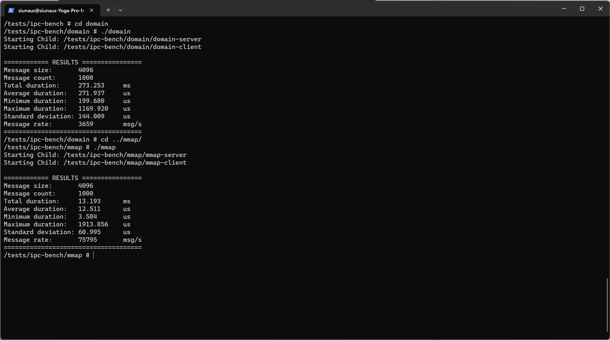

在本周，我在Ubuntu22.04系统上搭建了RISC-V的交叉编译工具链。

并使用上述工具链构建了修改过的支持RISC-V N扩展（用户态中断）的Linux内核及OpenSBI，QEMU模拟器。

并构建了最小Linux执行环境，且成功在QEMU模拟器中运行了修改过的Linux内核：

且使用上述工具链构建了用户态中断示例程序，并且在Linux内核中运行了该程序：

此外，我还交叉编译了用于测试跨进程通讯性能的程序集：IPC-bench。

并且进行过代码调整和编译选项的调整后，IPC-bench的程序可以正常运行在修改过后的Linux内核上：

下周计划编写用户态中断在IPC-bench中的实现，进行测试并得到性能数据比较。

未来计划和学长一起在RocketChip硬件上实现用户态中断。