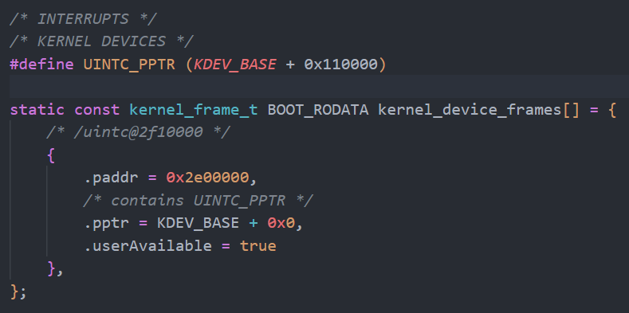
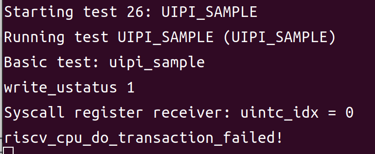

# 5.28

本周首先补完了在进入异常和退出异常时对于用户态中断相关寄存器的保存和恢复，并继续推进接入UINTC的相关工作：

经过分析生成device_gen.h的python组件，决定将UINTC设置为kernel-device以让内核在初始化时直接将对应的地址范围写入页表。

在kernel/tools/hardware.yml中添加UINTC的相关支持信息以及大小：

```yaml
  - compatible:
      - riscv,uintc0
    regions:
      - index: 0
        kernel: UINTC_PPTR
        kernel_size: 0x4000
        user: true
```

并在spike.dts文件中添加相关的设备树选项：

```
  aliases {
    uintc = "/uintc@2f10000";
  };
  chosen {
    bootargs = "";
    seL4,kernel-devices = "uintc";
  };
    uintc@2f10000 {
    interrupts-extended = <0x08 0x00 0x06 0x00 0x04 0x00 0x02 0x00>;
    reg = <0x00 0x2f10000 0x00 0x4000>;
    interrupt-controller;
    compatible = "riscv,uintc0";
    user_ok;
  };
```

经过上述修改后，成功生成了具有相关信息的头文件：



但是可以发现生成的paddr不是期望的0x2f10000，经过检查，这是由于生成时自动进行了2MiB的页对齐。且注意到上面的UINTC_PPTR存在0x110000的偏移量，故该做法没有问题。

以上，可以认为成功将UINTC接入了seL4中。

开始着手将uipi_test接入seL4test中。

seL4test是一个seL4的自动化测试框架，可以自动配置测试用的环境。

这周已经成功在seL4test的框架中加入uipi_sample，如下图所示：



但是目前无法正常运行，现在正在排查中。

## 下周计划

将uipi_sample中的问题修复，让其可以正常运行。并将ipc-bench-uintr移植到seL4bench中，测试用户态中断的性能。在现有的模拟环境中开启多核。
