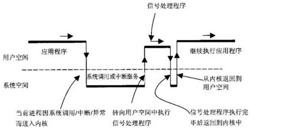
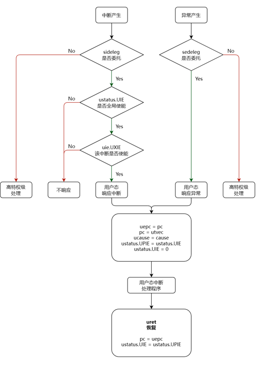
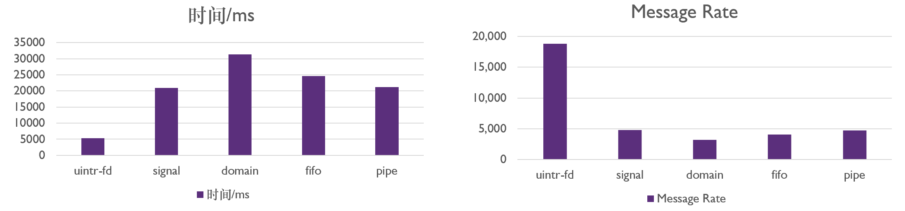
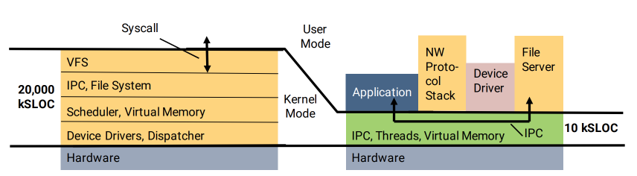
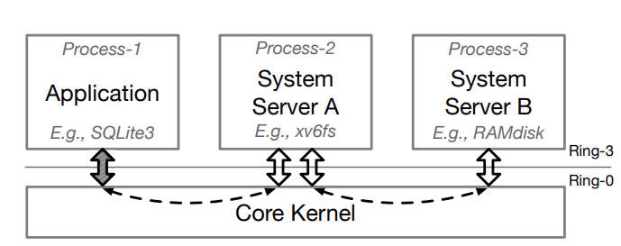
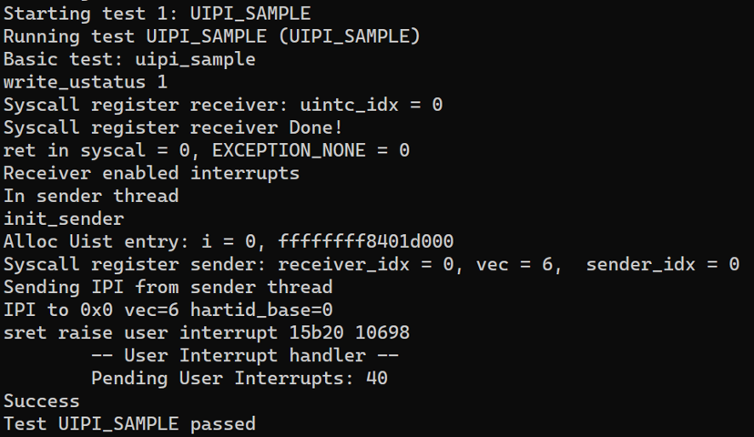
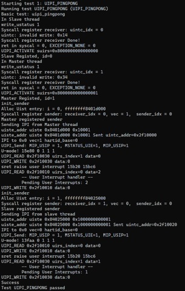

# 用户态中断 Final Doc

致理-信计01 张闰清 2020012701

## Backgourd

在OS中，进程间的通信是一个非常频繁的事情。现在存在的一些实现有管道、信号等。

为了修复meltdown, spectre的漏洞，内核引入了KPTI。

以信号为例，一次典型的信号发送过程如下图所示：



多次切换用户空间和内核空间，切换页表。在这其中就会使TLB失效。

## RISC-V N扩展

RISC-V N扩展为RISC-V添加了用户态中断的支持，如用户态中断所需的CSR寄存器，完成中断处理后返回正常程序执行流程的uret等。

UNITC 跨核中断控制器

- 用于处理发送方和接收方的映射以及处理uip寄存器。

- 由OS进行管理。



## OS in user interrupt

根据RISC-V N扩展的内容，实现用户态中断的OS需要完成对UINTC的管理。具体来说，需要实现如下几个syscall:

- Register_sender/Unregister_sender: 发送方用于注册或释放。

- Register_reciever/Unregister_receiver: 接收方用于注册或释放。

- uintr_create_fd: 用于创建接收方的文件描述符。

首先在已经完成修改的Linux上实现了用户态中断的IPC-Bench，并进行相关性能测试。

- Parameters: Message Size: 1bit, Message Count: 100000



## seL4

seL4 是一个微内核操作系统，它本身不是一个完整的操作系统。它只提供有限的 API，没有提供如传统的操作系统 Linux 那样的内存管理、页内外交换、驱动程序等等。

seL4微内核通过了形式化验证，在形式上证明了其没有Bug。

seL4 是第三代微内核操作系统，基本上可以说是基于 L4 的，它提供了虚拟地址空间（virtual address spaces）、线程（threads）、IPC（inter-process communication）。（这里是伏笔）

计划在seL4上实现用户态中断作为IPC实现。	



### Why

seL4是一个微内核操作系统，只提供了较少的功能。大部分功能都需要通过用户态程序实现，如文件系统，数据库，网络服务器等。
如文件系统，通常有这两个进程：文件系统服务器和块设备服务器。这两个进程之间有频繁的通信。那么优化IPC将会对文件系统的整体效率有提高。



## seL4 user interrupt design

首先完整地介绍一下用户态中断的运行流程：

1. 用户程序发起注册接收方的系统调用，系统在UINTC中申请一个接收方编号。
   - 每当从S-Mode返回U-Mode时，要将该进程所在的核以及UIRS(User Interrupt Receiver Status)表项写入UINTC中。同时将接收方编号写入SUIRS寄存器中。

2. 接下来通过一些方法（如系统原有的IPC）将接收方的编号（Linux是通过fd，seL4直接使用系统原生的Send/Recv）发送给用户态中断的发送方。

3. 发送方使用接收方的编号和中断向量注册发送方。
   - 每当从S-Mode返回U-Mode时，要将发送方的接收方表地址写入SUIST寄存器中。

4. 发送方使用UIPI指令让UINTC向接收方发送中断。
     - UINTC会先根据SUIST寄存器找到发送方的接受方表，确定接收方。
     - UINTC查UIRS表，确定接收方的状态，若正在运行这直接发起中断，否则暂存中断，直至该进程被调度。

我在seL4中共设计了两个系统调用用来处理用户态中断：

- Uintr_register_receiver: 用来注册接收方，无参数。
- Uintr_register_sender: 用来注册发送方，参数为接收方id和中断向量。

与Linux中的设计不同，我并没有加入uintr_create_fd的系统调用，因为seL4没有fd的概念。为了解决fd缺失带来的问题，我改变了uintr_register_sender的接口，需要将接收方id和中断向量传入。

此外，还设计了一系列函数用来和UINTC进行交互，以及在S-Mode和U-Mode切换时需要进行的一些处理。

## Attaching UINTC in seL4

经过对seL4系统对硬件的支持，决定将UINTC以Kernel Device接入seL4中：

1. 在seL4的硬件支持表中添加UINTC的信息，让seL4知道自己支持UINTC。

2. 从QEMU中dump出UINTC相关的设备树信息。

3. 将设备树信息写入seL4支持的硬件树文件(spike.dts)。

4. 在编译内核期间，构建系统通过python脚本生成dtb文件，再通过一些python程序生成一个配置头文件。

5. 内核在启动时通过上述头文件将对应的地址进行映射，UINTC驱动程序通过头文件的一些定义可以访问到该地址。

## Results

为了验证实现的正确性，我首先利用seL4-test框架设计了测例uipi_sample和uipi_pingpong。
这两个测例均是单进程，多线程的结构。前者是一个单向的测试程序，而后者是一个双向的测试程序，一方发送后等待接收，另一方先接受到中断后再发送。
最终结果是两者均能正常运行：





## Performance

为了测试性能，我设计了进程间的通信，而非线程间的通信。测试共两组，分别测量单向和双向通信的性能。
注：由于seL4在RISC-V下生态并不是很完整，因此并没有办法完整准确测得性能，以下性能数据来自对CSR寄存器cycle的读取，注意这其中可能包含了系统调度时的时间和内核态的时间。

|   **测例**    | **时间**/cycles | **Speedup** |
| :-----------: | :-------------: | :---------: |
|  IPC_SAMPLE   |    14869856     |    1.0x     |
|  UIPI_SAMPLE  |     1013632     |   14.67x    |
| IPC_PINGPONG  |    15834848     |    1.0x     |
| UIPI_PINGPONG |     1187040     |   13.39x    |

## seL4 Limitations

在seL4开发过程中，还是遇到了很多困难和限制，如：

- seL4的独特的微内核架构是以前没有见过的，有很多宏内核有的功能seL4没有，对于开发有一定困难。如：无法在内核中申请内存（或是非常复杂）。

- seL4没有内核文档，给内核开发造成了很大困难，大部分时间花在文档缺失造成的影响上。

- seL4对于RISC-V的生态较差，缺失了很多功能，如性能测试相关接口，和计划用来测试性能的框架seL4bench。

- seL4若想运行在RISC-V模拟器上，仅有spike一种机器可以选择，该机器不支持多核。


修改的代码包括seL4内核，seL4test测例，QEMU。


整个源代码包为```seL4-test.tar.gz```

kernel修改的文件为：

- kernel/src/arch/riscv/uintr.c

- kernel/include/arch/riscv/arch/uintr.h

- kernel/src/api/syscall.c

- kernel/arch/riscv/machine/hardware.c

外围文件的修改包括:

- tools/dts/spike.dts
- tools/hardware.yml

测例文件包括:

- projects/sel4test/apps/sel4-test/src/tests/*

