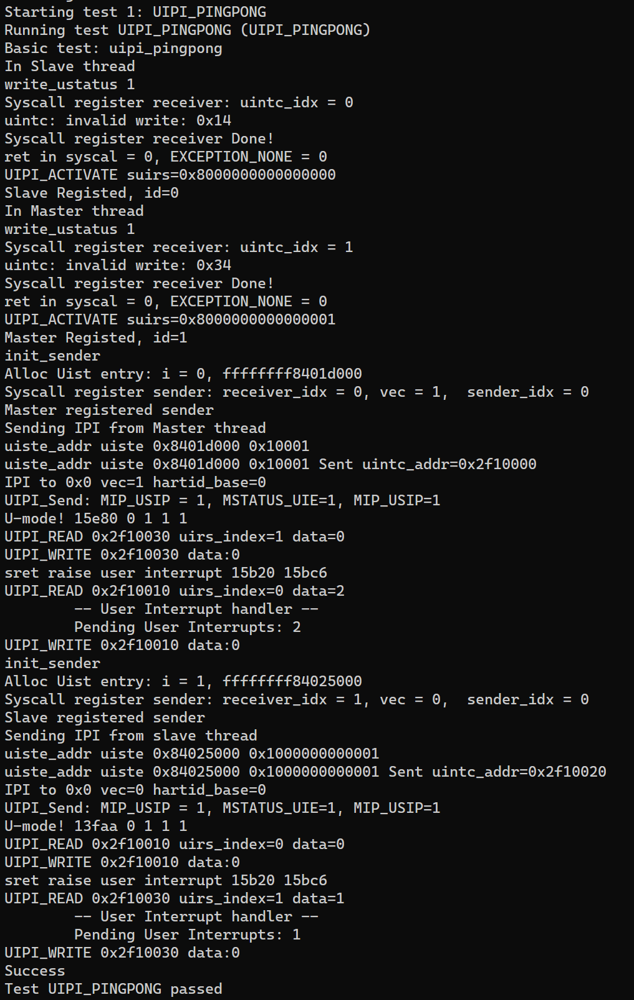

# Wk15

本周继续推进了UINTC接入以及测试工作。

上周的cpu_transaction_failed是因为在QEMU侧没有接入。原本的QEMU实现的UINTC是在-machine virt上的，而seL4要求的machine为spike，故在QEMU中添加了一些代码以将UINTC实现在spike上。

在这之后，不再出现cpu_transaction_failed问题。尝试运行uipi_sample，发现出现Page Fault，调查后发现这个问题出现在pthread库中。花了一些时间尝试修复这个问题，未果，在后续的调查中发现seL4并未支持pthread。

而考虑到测试框架并不支持多进程的测试，只能寻找启动线程的方式。

在测试框架的helper.h中找到了相关调用: create_helper_thread, start_helper, wait_for_helper。

使用上述调用对uipi_sample进行适配，不会再出现Page Fault的错误，但是发现了一些内核中用户态中断实现的问题，修复后可以运行至结束，如下图：

可以发现，出现了一次pending interrupts为0的中断，这是不正常的。在通过GDB联合调试kernel，QEMU和用户态程序后，可以定位到问题出现的原因是：当用sret返回用户态时，会先检查是否存在pending的用户态中断，如果有则直接调用handler，而正常情况下从sret返回时会在UINTC中将该receiver的active为置为1（即执行uipi_activate()），此时就不会发生。但是在执行UIPI_read读取pending中断时，会先检查该receiver的active是否为1，若不是则直接返回0，这也是这里出现的问题。定位到原因后，我更改了QEMU的代码，用sret返回用户态时，如果存在pending的中断，则直接执行uipi_activate()。

修复上述问题后，可以看到uipi_sample输出了预期的结果：

在此之后，为了进一步测试相关实现的正确性，我实现了一个双向通信的测试程序: uipi_pingpong，运行结果如下：

此后，我调研了Benchmark的相关信息，发现seL4在RISCV下没有提供相应的benchmark支持，这意味着seL4中基本的IPC实现：notification也无法进行性能测试。

上周向老师提出的将用户态中断的接口改为与Notification一致，这周也进行了相关调研，主要的问题是调用库的pattern与用户态中断不一致，因此无法做到这点。